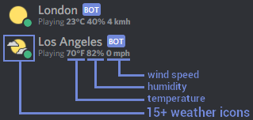
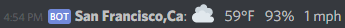
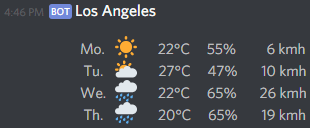

# Features
## Real-time weather
The discloud bot is displaying **real-time weather** at the configured location **directly on its Discord profile** :



Users can also obtain the **current weather** at **any location**, using the command `!weather [location]`, for example `!weather San Francisco,CA`:



## Weather forecast

Users can obtain the weather forecast for any location using the command `!forecast [location]`, for example `!forecast Los Angeles,CA` :



If the `[location]` argument is not provided, the bot's configured location (for the real-time weather) will be used. 

# Setup
## Prerequisites
1. [Obtain your (free) Open Weather Map API key](https://openweathermap.org/appid)
2. (Optional) [Obtain your (free) Weather Underground API key](https://www.wunderground.com/weather/api/d/pricing.html)
2. [Create a (dedicated) Discord bot account](https://github.com/Just-Some-Bots/MusicBot/wiki/FAQ#how-do-i-create-a-bot-account) and save its Token
3. [Add the bot account to your Discord server](https://github.com/Just-Some-Bots/MusicBot/wiki/FAQ#how-do-i-add-my-bot-account-to-a-server)

## Docker (recommended)
1. Create the following `docker-compose.yml` file and configure the required environment variables obtained 
through the prerequisites:
```yaml
version: "3"
services:
  discloud:
    # use the :arm tag if the bot is running on an ARM architecture (e.g. Raspberry Pi)
    image: mbouchenoire/discloud[:arm]
    environment:
      OPEN_WEATHER_MAP_API_KEY:
      DISCORD_BOT_TOKEN:
      # the location from which the bot will provide real-time weather (e.g. 'Paris,fr')
      HOME_FULL_NAME:
    restart: always
``` 
2. Start the bot's container using [docker-compose](https://docs.docker.com/compose/): `docker-compose up`

In order to update the bot once its container is running, run these commands where the 
`docker-compose.yml` file is located:
```bash
# use the :arm tag if the bot is running on an ARM architecture (e.g. Raspberry Pi)
docker pull mbouchenoire/discloud[:arm]
docker stop discloud
docker rm discloud
docker-compose up
```

## Debian 8+
1. Install [Git](https://git-scm.com/): `sudo apt-get install git-all`
2. Clone the discloud Git repository: `sudo git clone github.com/mbouchenoire/discloud.git /etc`
3. Configure the bot's [environment variables](#advanced-configuration) `export SOME_ENV_VARIABLE="value"`
4. Run the bot using [Python](https://www.python.org/):
    1. install [pip](https://pypi.python.org/pypi/pip) : `sudo apt-get install -y python3-pip`
    2. install the bot dependencies `sudo pip3 install -r requirements.txt`
    3. run the Python script `sudo python3 discloud/__ini__.py &`
    
## Advanced configuration
The discloud bot depends on multiple environment variables that can be configured:

| Environment variable | Value | Comment |
| --- | --- | --- |
| `OPEN_WEATHER_MAP_API_KEY` | See [here](https://openweathermap.org/appid) | **Required** |
| `WEATHER_UNDERGROUND_API_KEY` | See [here](https://www.wunderground.com/weather/api/d/pricing.html), improve the weather accuracy if provided, but limited to 10 requests per minute. Open Weather Map will be used when the limit is reached | ***Recommended*** |
| `DISCORD_BOT_TOKEN` | See [here](https://github.com/Just-Some-Bots/MusicBot/wiki/FAQ#how-do-i-create-a-bot-account) | **Required** |
| `HOME_FULL_NAME` | The full name of the home location, in order to handle different locations with the same name (e.g. `Paris,fr`) | **Required** |
| `HOME_DISPLAY_NAME` | The location shorthandle (e.g. `Paris`) | Optional (default: `HOME_FULL_NAME`) |
| `MEASUREMENT_SYSTEM` | [`metric` &#124; `imperial`] | Optional (default: `metric`) |
| `MORNING_FORECAST_TIME` | from `00:00` to `23:59`, you can explicitly set it to an empty value if you don't want periodic morning forecasts | Optional (default: `8:00`), the timezone of your Docker container will be used |
| `EVENING_FORECAST_TIME` | from `00:00` to `23:59`, you can explicitly set it to an empty value if you don't want periodic evening forecasts | Optional (default: `20:00`), the timezone of your Docker container will be used |
| `PERIODIC_FORECAST_CHANNELS` | The channel names where the periodic forecasts will be broadcasted, separated by a comma ','| Optional (default: `general,weather`) |
| `LANGUAGE` | [`en` &#124; `ru` &#124; `jp` &#124; `de` &#124; `es` &#124; `fr`], The language in which the bot will respond to commands | Optional (default: `en`) |
| `CONCURRENCY_PRIORITY` | [`always` &#124; `auto` &#124; `never`], defines the responding behavior of this discloud instance when multiple discloud instances are running on the same Discord server. The `auto` value gives priority to the discloud bot with the lowest discord ID | Optional (default: `auto`) |
| `LOGGING_LEVEL` | [`critical` &#124; `error` &#124; `info` &#124; `debug`] | Optional (default: `info`) |

You can directly add these environment variables inside the `docker-compose.yml` file, in the `services.discloud.environment` section.